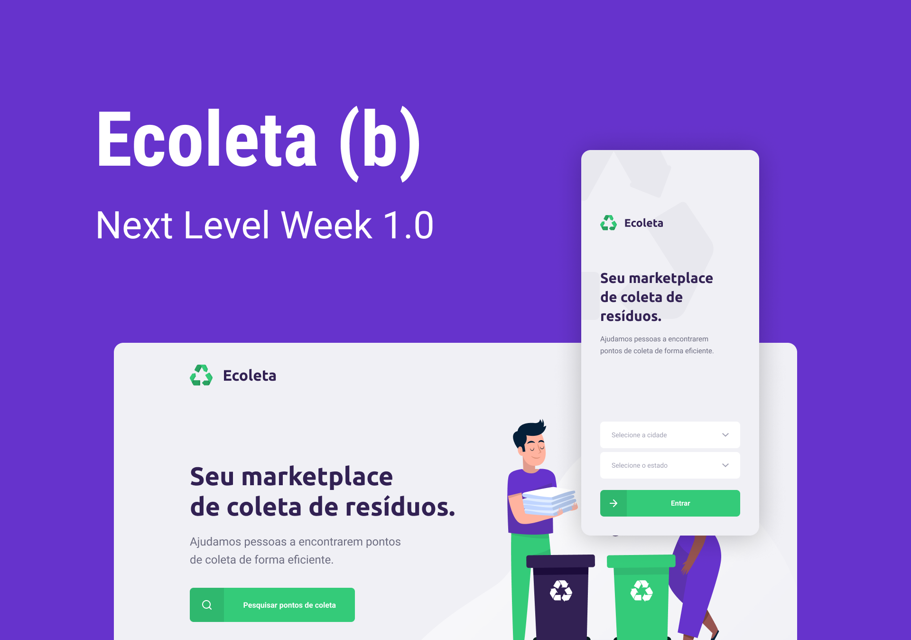

<p align="center">
   
</p>

<h2 align="center">
  Next Level Week - Rocketseat
</h2>

[](https://github.com/FelipeRRPereira)
[](#)
[](https://github.com/FelipeRRPereira/nlw/issues)
[](https://github.com/FelipeRRPereira/nlw/network)
[](https://github.com/FelipeRRPereira/nlw/stargazers)

## Índice

<ul>
  <li><a href="#-iniciando-projeto">Iniciando projeto</a></li>
  <li><a href="#-back-end-node-com-typescript">Back-end Node com TypeScript</a></li>
  <li><a href="#-front-end-react-com-typescript">Front-end React com TypeScript</a></li>

  <li><a
  href="#-mobile-react-native-com-typescript">Mobile React-Native com TypeScript</a></li>
</ul>

## 🚀 Iniciando no projeto

---

### Pré-requisitos

- Para rodar o projeto será necessário instalar o [Node](https://nodejs.org/en/download/) e o [Expo](https://expo.io/).
- Clonar este repositório para sua maquina local.

```powershell
git clone https://github.com/FelipeRRPereira/nlw
```

Note que a três pastas no `/` do projeto que são _`server`_, _`web`_ e _`mobile`_. Navegue para cada uma delas e siga a instrução a seguir.

## 🏗️ Back-end Node com TypeScript

### Instalar dependências

- Execute o seguinte comando na pasta `/server`.

```powershell
npm install
```

Dependências:

- Celebrate - uma função _middleware_ que permite executar validações nas entradas de uma rota.
- Cors - lib responsável por liberar as permissões necessárias para acessar links de domínios diferentes.
- Express - _framework_ para Node.js que implementa facilmente o conceito _MVC_ com rotas robustas.
- Knex - _query builder_ bastante utilizado para efetuar consultas no bancos de dados _SQL_.
- Multer - um _middleware_ para manipulação do `multipart/form-data`, utilizado principalmente para upload de arquivos.
- Sqlite3 - biblioteca que implementa um banco de dados _SQL_ embutido.

### Rodar projeto

- Execute o seguinte comando:

```powershell
npm run dev
```

## 💻 Front-end React com TypeScript

### Instalar dependências

- Execute o seguinte comando na pasta `/web`.

```powershell
npm install
```

Dependências

- Axios - responsável por realizar as requisições _HTTP_.
- Leaflet - lib de mapas.
- React-dom - responsável por manipulação e renderização do _DOM_.
- React-dropzone - lib de _drag and drop_ disponibilizada em uploads de arquivo.
- React-icons - lib de ícones bastante robusta.
- React-leaflet - componente _React_ para utilizar o mapa do _Leaflet_.
- React-router-dom - responsável por todos os elementos _DOM_ de links e chamadas de rotas.
- React-scripts - lib de scripts e configurações usadas pelo _Create React App_.

### Rodar projeto

- Execute o seguinte comando:

```powershell
npm start
```

## 📱 Mobile React-Native com TypeScript

### Instalar dependências

- Execute o seguinte comando na pasta `/mobile`.

```powershell
npm install
```

Dependências

- Axios - responsável por realizar as requisições _HTTP_.
- Expo - plataforma de criação de aplicativos nativos e web utilizando JavaScript.
- Expo-font - lib de carregamento de fontes em momento de execução.
- Expo-location - lib que permite ler informações de geolocalização do dispositivo.
- Expo-mail-composer - lib de compor e-mail utilizando ferramentas padrão do OS.
- React-dom - responsável por manipulação e renderização do _DOM_.
- React-native-gesture-handler - responsável por realizar os gestos nativos de navegação.
- React-native-maps - responsável pelo mapas.
- React-native-reanimated - fornece uma flexibilidade em interações baseadas em gestos.
- React-native-safe-area-context - responsável por lidar com a _Safe area_.
- React-native-screens - expõe componentes de navegação nativos ao _React Native_.
- React-native-svg - fornece suporte _SVG_.
- React-native-web - obtém componentes e _APIs_ independentes da plataforma _React Native_ para a _Web_.

### Rodar projeto

- Execute o seguinte comando:

```powershell
expo start
```
